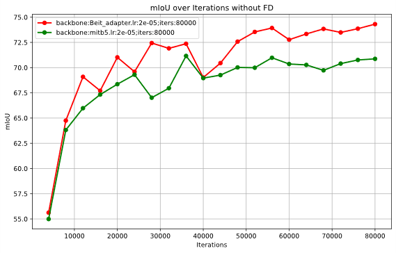

## HRDA: Context-Aware High-Resolution Domain-Adaptive Semantic Segmentation

## Improvement


The main design philosophy of ViT-Adapter lies in adding an auxiliary branch to the original Vision Transformer (ViT).

## Results


## Setup Environment

For this project, we used python 3.8.5. We recommend setting up a new virtual
environment:

```shell
python -m venv ~/venv/hrda
source ~/venv/hrda/bin/activate
```

In that environment, the requirements can be installed with:

```shell
pip install -r requirements.txt -f https://download.pytorch.org/whl/torch_stable.html
pip install mmcv-full==1.3.7  # requires the other packages to be installed first
```

In order to use Vit-Adapter, you need to install some extra environments requirements.

```shell
pip install timm==0.4.12
cd mmseg/models/ops
sh make.sh # compile deformable attention
```

Please download the BEiT weights provided by [BEiT](https://github.com/microsoft/unilm/tree/master/beit) from BEiT-large: [beit_large_patch16_224_pt22k_ft22k](https://github.com/addf400/files/releases/download/v1.0/beit_large_patch16_224_pt22k_ft22k.pth) and put it in the folder `pretrained/`.


## Training

For convenience, we provide an [annotated config file](configs/hrda/gtaHR2csHR_hrda.py)
of the final HRDA. A training job can be launched using:

```shell
python run_experiments.py --config configs/hrda/gtaHR2csHR_hrda.py
```

The logs and checkpoints are stored in `work_dirs/`.

## Testing & Predictions

The provided HRDA checkpoint trained on GTA→Cityscapes can be tested on the
Cityscapes validation set using:

```shell
sh test.sh work_dirs/gtaHR2csHR_hrda_246ef
```
