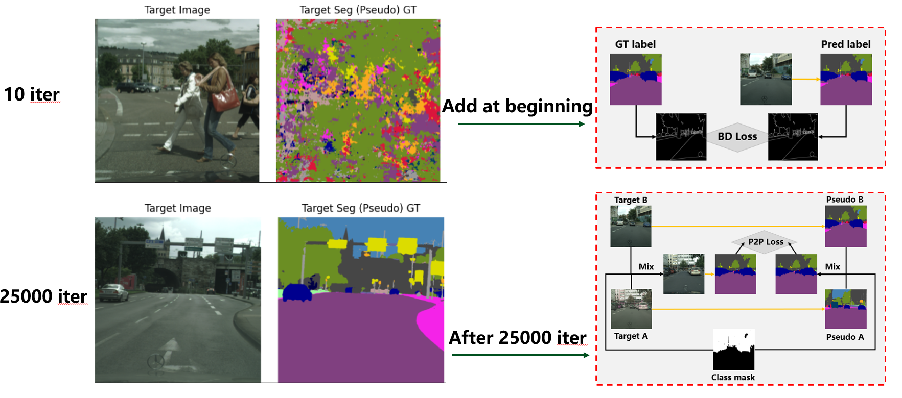

## Cross-Domain Semantic Segmentation with Continued Migration to Target Domain

**Abstract:** Unsupervised domain adaptation (UDA) has become a key technology in machine learning, which enables models trained on labeled data in one domain to be effectively generalized to an unlabeled target domain. Existing UDA methods mainly address the challenges of cross-domain semantic segmentation by improving the information expression of data feature space and model network design, and achieve good results. Starting from making more full use of target domain data, this paper first proposes a novel P2P module to supervise segmentation task learning by leveraging reliable hybrid pseudo-labels.And we add necessary canny loss to accelerate convergence, so that the focus of the model is further transferred to the unknown domain. We also use multiple ways to perform stylized transfer to reduce the data domain difference. In addition, ViT-Adapter is introduced as a better feature extraction backbone to improve the fusion of global and local information, and DPT head is used to provide more fine-grained and globally consistent predictions. We validate our method in GTA5 → Cityscapes and Synthia → Cityscapes. When using the P2P module and stylized transfer, the segmentation results of our method reach 76.2% mIoU and 68.5%, which are 3.4mIoU and 2.7mIoU higher than the baseline, and reach the most advanced level in GTA5 → Cityscapes. If there is a larger VRAM, combined with the improvements of Backone and Attention Head, our method can achieve better results.

:bell: **Notes:**

This project contains multiple branches, which store the code of different innovative parts.

Details: 

- **[P2P/style_transfer](https://github.com/zhanglk9/UDA-plus/tree/P2P/style_transfer)**: The data level is divided into three parts. The first is the P2P module, which is Reliable pseudo-tags to pseudo-tags, and then the edge loss. It extracts edge features for semantic segmentation and then performs loss to add new constraints to the model. The third part is the style transfer of source domain and target domain data to reduce the domain difference between source domain and target domain data;
- **[backbone/vit-adapter](https://github.com/zhanglk9/UDA-plus/tree/backbone/vit-adapter)**: We introduce ViT-Adapter to combine the advantages of ViT and MiT-b5 to improve global semantic modeling, modular adaptability and feature expression flexibility. ViT-Adapter adds a branch to the traditional Vision Transformer (ViT) to enhance local feature capture and multi-scale information modeling capabilities.
- **[dpt_head](https://github.com/zhanglk9/UDA-plus/tree/dpt_head)**: We introduce the DPT structure adopted in dense vision transformers, an architecture that utilizes ViT instead of CNN for dense prediction tasks. The Transformer backbone processes consistent and relatively high-resolution inputs and has a global receptive field at each stage. These properties allow the Dense Vision Transformer to provide finer-grained and more globally consistent predictions compared to traditional CNNs.

This code is developed based on [HRDA](https://github.com/lhoyer/HRDA). Some of the codes are not very clean due to timing issues. If necessary, we will continue to organize more concise code later. Stay tuned!
## Setup Environment

For this project, we used python 3.8.5. We recommend setting up a new virtual
environment:

```shell
python -m venv ~/venv/hrda
source ~/venv/hrda/bin/activate
```

In that environment, the requirements can be installed with:

```shell
pip install -r requirements.txt -f https://download.pytorch.org/whl/torch_stable.html
pip install mmcv-full==1.3.7  # requires the other packages to be installed first
```

Please, download the MiT-B5 ImageNet weights provided by [SegFormer](https://github.com/NVlabs/SegFormer?tab=readme-ov-file#training)
from their [OneDrive](https://connecthkuhk-my.sharepoint.com/:f:/g/personal/xieenze_connect_hku_hk/EvOn3l1WyM5JpnMQFSEO5b8B7vrHw9kDaJGII-3N9KNhrg?e=cpydzZ) and put them in the folder `pretrained/`.
Further, download the checkpoint of [HRDA on GTA→Cityscapes](https://drive.google.com/file/d/1O6n1HearrXHZTHxNRWp8HCMyqbulKcSW/view?usp=sharing) and extract it to the folder `work_dirs/`.

In order to use Vit-Adapter, please install some extra environments requirements first.

```shell
pip install timm==0.4.12
cd mmseg/models/ops
sh make.sh # compile deformable attention
```
Please download the BEiT weights provided by [BEiT](https://github.com/microsoft/unilm/tree/master/beit) from BEiT-large: [beit_large_patch16_224_pt22k_ft22k](https://github.com/addf400/files/releases/download/v1.0/beit_large_patch16_224_pt22k_ft22k.pth) and put it in the folder `pretrained/`.


## Style transfer

If you want try DGInstyle, please ref [DGInstyle](https://github.com/prs-eth/DGInStyle), and then we filter useful data based on rare classes and lighting conditions, runs:
```shell
python tools/convert_datasets/gta.py data/dg_dataset/halfxxx --nproc 8
python tools/rcs_sample_dg_data.py
#!!!!Need to manually modify the file internal path name!!!!
python json_add.py
```
If you want try Basic transfer, please runs:
```shell
python tools/convert_datasets/base_transfer.py
python tools/convert_datasets/gta.py data/basic_style --nproc 8
#!!!!Need to manually modify the file internal path name!!!!
python json_add.py
```


## Training

For convenience, we provide an [annotated config file](configs/hrda/gtaHR2csHR_hrda.py)
of the final HRDA. A training job can be launched using:

```shell
python run_experiments.py --config configs/hrda/gtaHR2csHR_hrda.py
```

The logs and checkpoints are stored in `work_dirs/`.

## Testing & Predictions

The provided HRDA checkpoint trained on GTA→Cityscapes can be tested on the
Cityscapes validation set using:

```shell
sh test.sh work_dirs/gtaHR2csHR_hrda_246ef
```
## Work summary & Result
### P2P & Style transfer


#### Results

### Backbone-Improvement

The main design philosophy of ViT-Adapter lies in adding an auxiliary branch to the original Vision Transformer (ViT).

#### Results

### Attention Head-Improvement

#### Results


### For more experimental results and details, please refer to the submitted article.

